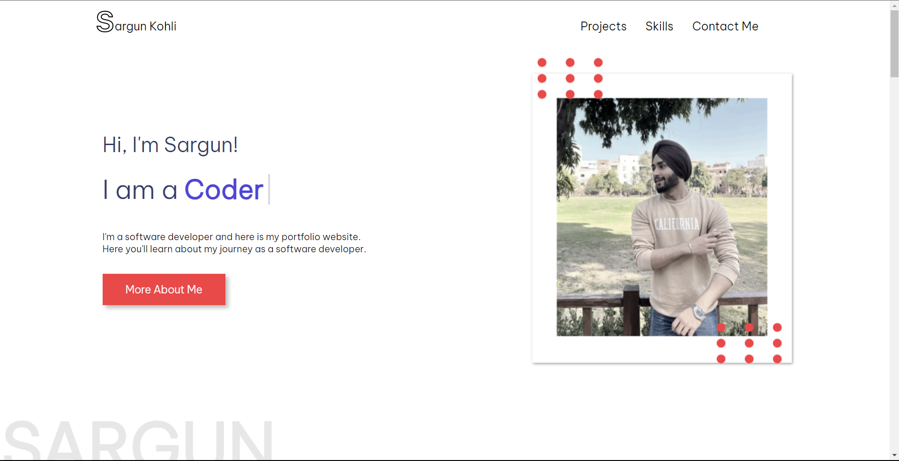
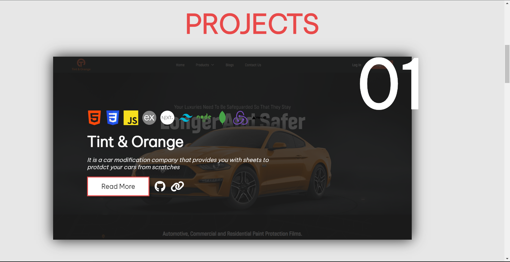
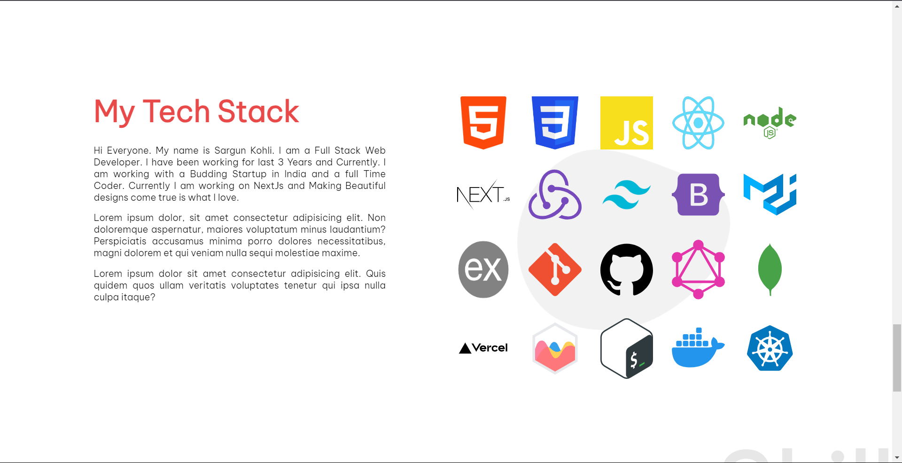
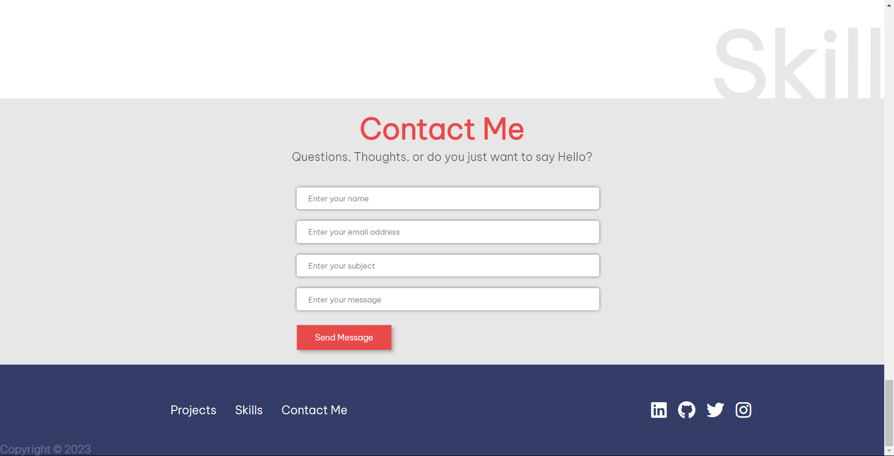

# My Portfolio Website

My Portfolio Website is a personal website designed to showcase my work, skills, and provide an overview of who I am. This project serves as an online portfolio, featuring sections that highlight my introduction, sample projects, tech stack, and a contact form.





## Table of Contents

- [Overview](#overview)
- [Installation](#installation)
- [Usage](#usage)
- [Technologies Used](#technologies-used)
- [Contributing](#contributing)
- [License](#license)

## Overview

My Portfolio Website offers an engaging and informative way to present my work and skills to visitors. Key features include:

- **Introduction Section:** A front section that includes a picture of me and a brief introduction.

- **Projects Showcase:** Sample project cards that provide information about project names, descriptions, technologies used, "Read More" buttons, GitHub links, and deployed site links.

- **Tech Stack:** A section highlighting the technologies I'm familiar with.

- **Contact Me:** A contact form (not connected to a backend) where visitors can reach out to me.

The project demonstrates my front-end development skills and serves as a personal online portfolio.

## Installation

1. Clone the repository:

   ```bash
   git clone https://github.com/sargunkohli152/Portfolio-Webiste-Design.git

2. Start the application in your code editor

## Usage
 - Introduction Section: Visitors can learn about me and my background.

 - Projects Showcase: Sample project cards provide details about my work, including project 
   names, descriptions, technologies used, GitHub links, and deployed site links.

 - Tech Stack: A section displays the technologies I'm proficient in.

 - Contact Me: Visitors can use the contact form to reach out to me (not connected to a 
   backend in this sample version).

## Technologies Used
 - HTML
 - CSS

## Contributing
Contributions are welcome! If you have any suggestions, improvements, or want to add new features to enhance My Portfolio Website, please fork the project, make your changes, and submit a pull request.

## License
MIT License

Permission is hereby granted, free of charge, to any person obtaining a copy of this software and associated documentation files (the "Software"), to deal in the Software without restriction, including without limitation the rights to use, copy, modify, merge, publish, distribute, sublicense, and/or sell copies of the Software, and to permit persons to whom the Software is furnished to do so, subject to the following conditions:

The above copyright notice and this permission notice shall be included in all copies or substantial portions of the Software.

THE SOFTWARE IS PROVIDED "AS IS", WITHOUT WARRANTY OF ANY KIND, EXPRESS OR IMPLIED, INCLUDING BUT NOT LIMITED TO THE WARRANTIES OF MERCHANTABILITY, FITNESS FOR A PARTICULAR PURPOSE AND NONINFRINGEMENT. IN NO EVENT SHALL THE AUTHORS OR COPYRIGHT HOLDERS BE LIABLE FOR ANY CLAIM, DAMAGES OR OTHER LIABILITY, WHETHER IN AN ACTION OF CONTRACT, TORT OR OTHERWISE, ARISING FROM, OUT OF OR IN CONNECTION WITH THE SOFTWARE OR THE USE OR OTHER DEALINGS IN THE SOFTWARE.
